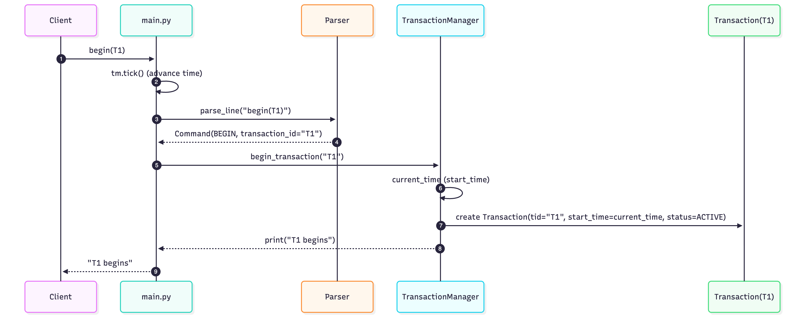
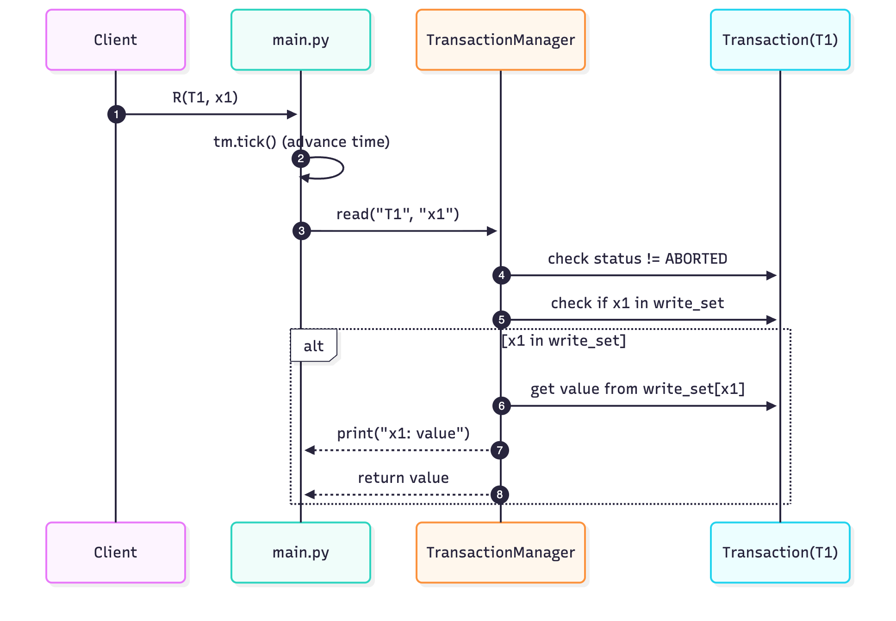
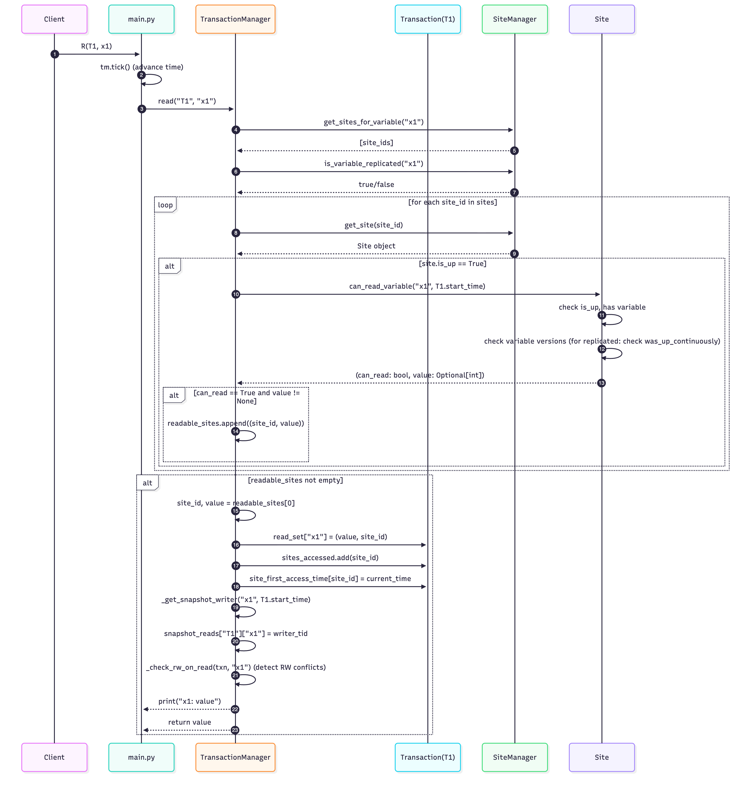
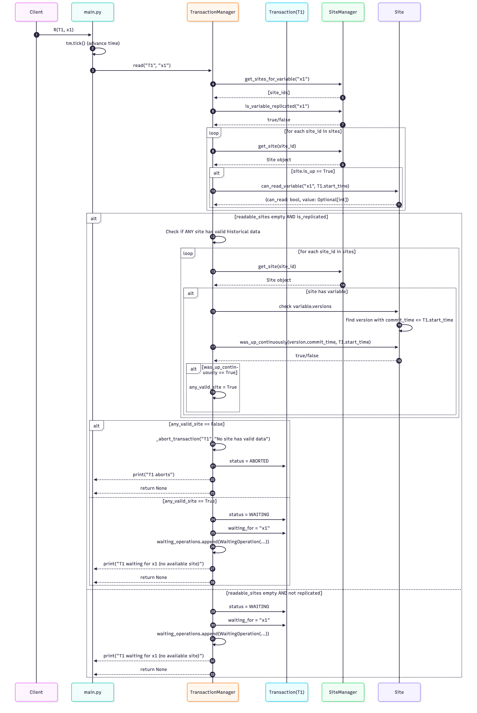
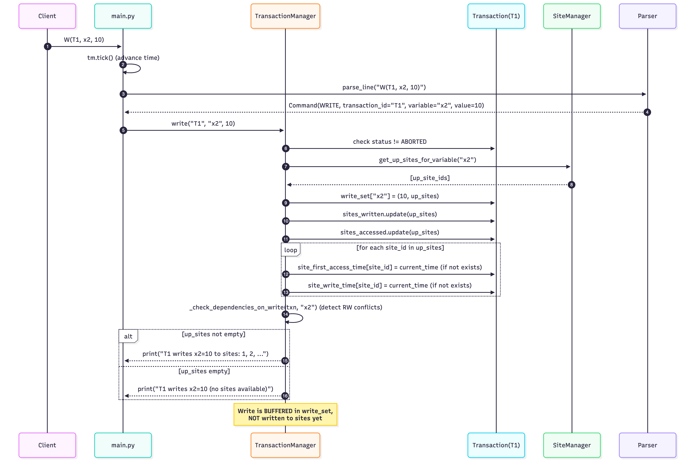
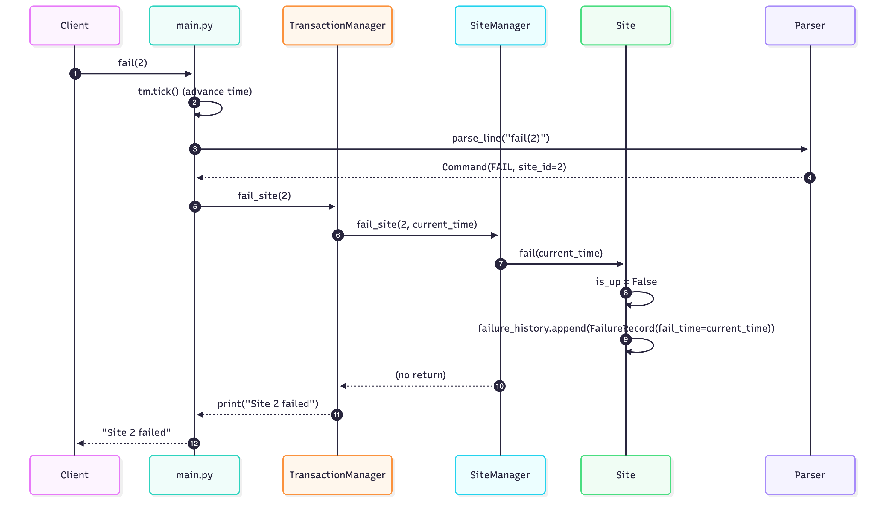
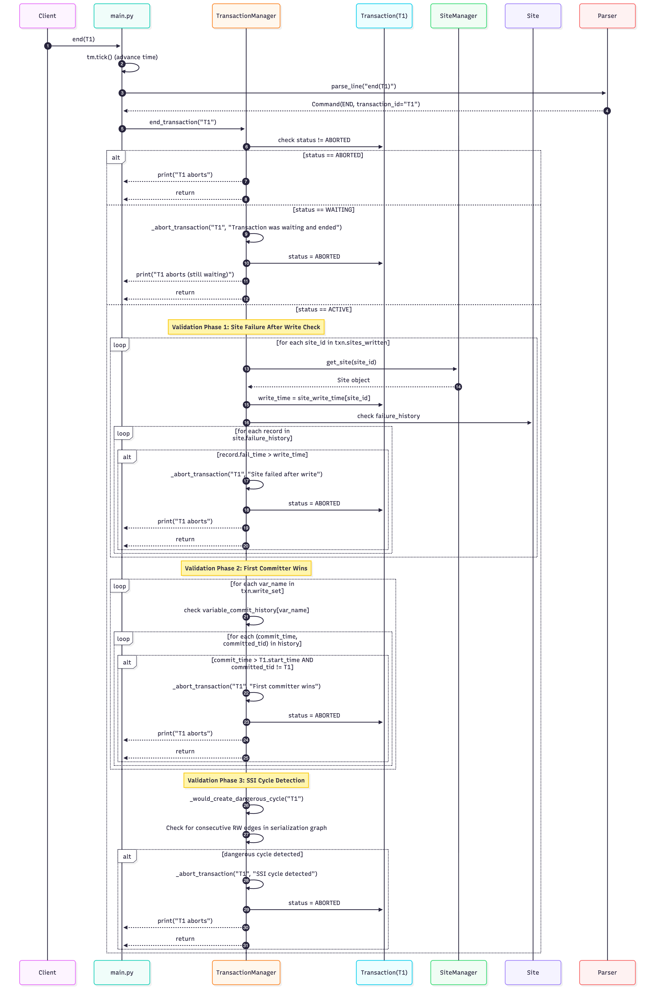
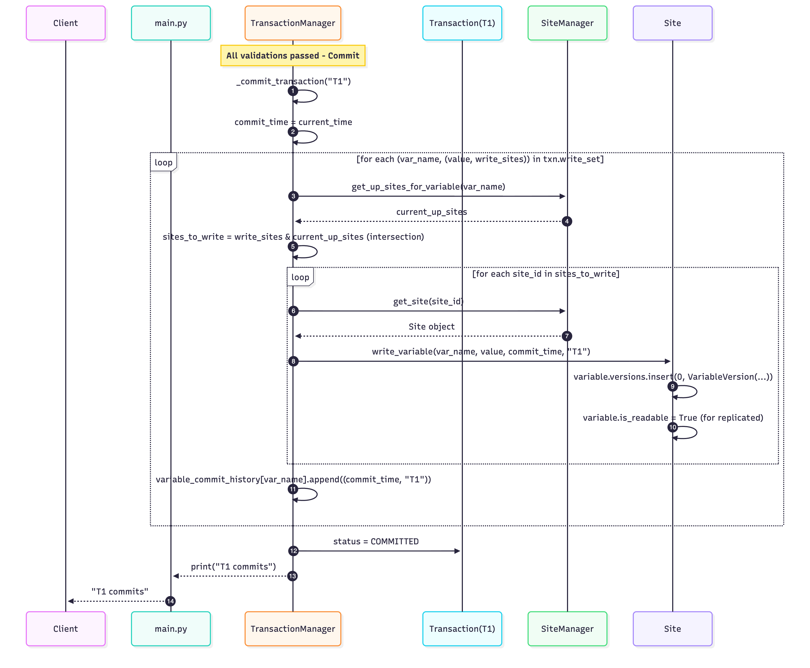
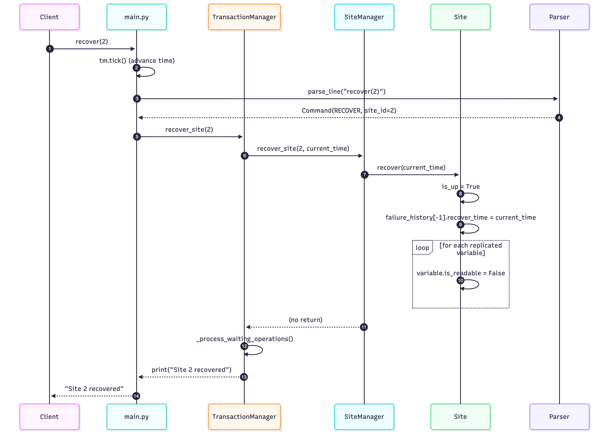
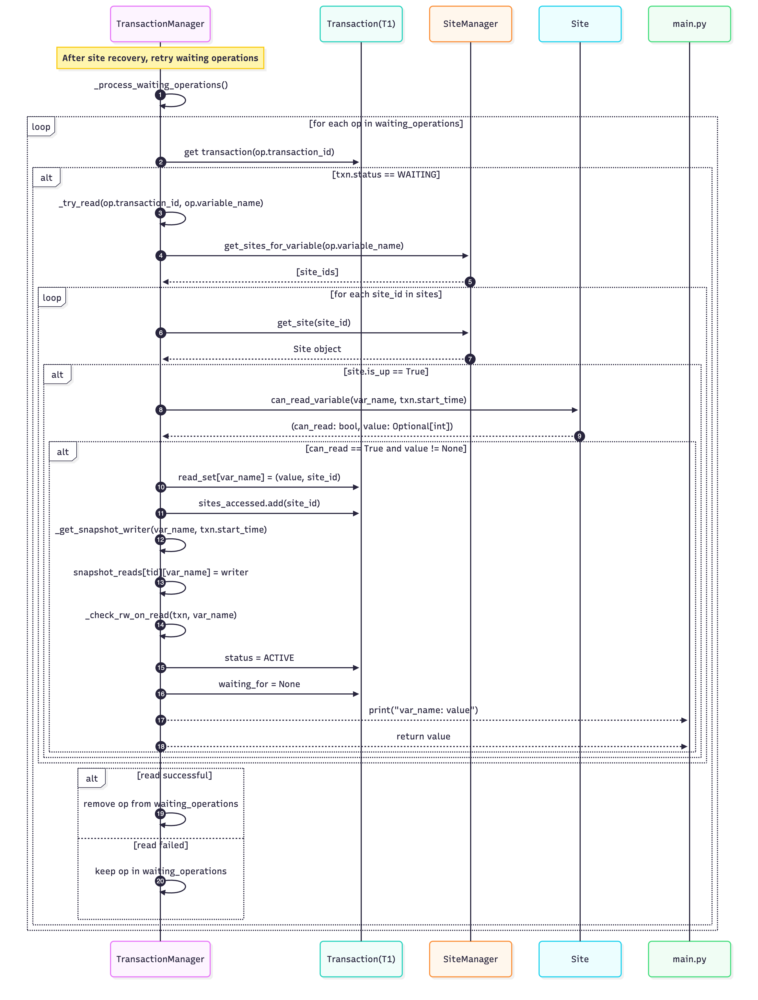

# RepCRec Project Design Document

**Authors:** Shaoyi Zheng (sz3684), Wenbo Lu (wl2707)

---

## Introduction

RepCRec (Replicated Concurrency and Recovery) is a distributed database that enforces Serializable Snapshot Isolation (SSI) across ten data sites using the Available Copies algorithm. The system provides a scripting interface for running workloads, detects serialization anomalies at commit time, and simulates site failures/recoveries so that replicated data must be validated before becoming readable again.

---

## Major Modules

| Module | Responsibility |
|--------|----------------|
| `src/parser.py` | Tokenizes each line of the input workload and emits structured commands. |
| `src/transaction_manager.py` | Coordinates transactions, enforces SSI rules, and drives commits/aborts. |
| `src/site_manager.py` | Owns the ten data sites, their failure history, and per-variable version chains. |
| `src/models.py` | Defines immutable data records (transactions, versions, waiting operations, etc.). |
| `main.py` / `run_tests.py` | CLI entry points for interactive execution or automated regression testing. |

---

## Implementation Details

### Command Parser (`src/parser.py`)

The parser is the front door for every workload line. It strips comments/whitespace, matches regular-expression patterns, and emits normalized `Command` objects so the downstream managers never parse strings themselves.

| Functionality | Inputs | Outputs | Purpose |
|---------------|--------|---------|---------|
| Regex matching | Raw text line | `CommandType`/payload | Classifies each statement (begin/read/write/fail/etc.). |
| File parsing | Path to workload file | List of commands | Streams the entire file through `parse_line` for batch execution. |

### Transaction Manager (`src/transaction_manager.py`)

This module orchestrates all transactions under SSI. It keeps the logical clock, manages read/write sets, records dependency edges for cycle detection, and enforces the Available Copies abort rule before applying durable commits.

| Function | Inputs | Outputs | Purpose |
|----------|--------|---------|---------|
| `begin_transaction(tid)` | Transaction ID | Console message | Registers a new ACTIVE transaction and timestamps it. |
| `read(tid, var)` | Transaction ID, variable name | Printed value or wait state | Executes snapshot reads; may queue the txn if no site can currently serve the version. |
| `write(tid, var, value)` | Transaction ID, variable, integer value | Console message | Buffers writes along with the set of sites that were up when the write occurred. |
| `end_transaction(tid)` | Transaction ID | Commit/abort message | Runs Available Copies validation, first-committer-wins, and SSI dangerous-cycle detection before committing. |
| `_would_create_dangerous_cycle(tid)` | Transaction ID | Boolean | Traverses RW/WW edges to decide if committing the txn would close a serialization cycle. |
| `fail_site(site_id)` / `recover_site(site_id)` | Site number | Console message | Propagate site state changes to the `SiteManager` and re-check waiting reads. |

### Site Manager (`src/site_manager.py`)

The site manager simulates the ten physical sites. It knows the placement policy, tracks failure/recovery intervals, exposes per-site read eligibility, and applies committed writes so replicas regain readability after recovery.

| Function | Inputs | Outputs | Purpose |
|----------|--------|---------|---------|
| `get_sites_for_variable(var)` | Variable name | List of site IDs | Applies distribution rules (odd: single home site, even: replicated). |
| `get_up_sites_for_variable(var)` | Variable name | List of site IDs | Filters the placement list down to currently operational sites. |
| `fail_site(site_id, timestamp)` / `recover_site(site_id, timestamp)` | Site ID, logical clock | None | Track failure intervals and reset readability status of replicated variables. |
| `can_read_variable(var, txn_start)` | Variable, timestamp | `(bool, value)` tuple | Checks availability, version history, and continuous uptime for SSI reads. |
| `write_variable(var, value, commit_time, tid)` | Variable, value, timestamp, txn ID | None | Appends a committed version and marks replicated copies readable post-write. |
| `dump_all()` / `site.dump()` | — | Console output / dict | Emits committed state per site for auditing and tests. |

### Data Models (`src/models.py`)

All shared data structures live here. These dataclasses capture transaction metadata, multi-version variables, and waiting read requests so the rest of the code can treat them as typed records instead of raw dictionaries.

| Structure | Inputs | Outputs | Purpose |
|-----------|--------|---------|---------|
| `TransactionStatus` | Enum literals | String labels | Distinguishes ACTIVE/COMMITTED/ABORTED/WAITING states. |
| `VariableVersion` | Value, commit time, writer ID | Immutable record | Captures a single committed version at a site. |
| `Variable` | Name, index, version list | Helper methods | Supplies “value at time” and latest-value lookups used by the site logic. |
| `Transaction` | TID, start time | Mutable record | Tracks read/write sets, accessed sites, and failure timestamps for validation. |
| `WaitingOperation` | TID, variable, site set | Immutable record | Represents a blocked read that resumes after a qualifying site recovers. |

---

## System Semantics & Requirements

### Data Distribution & Initialization

- 20 logical variables `x1` … `x20`.  
- Ten sites (`1`–`10`). Odd-indexed variables live at exactly one site: `site = 1 + (index mod 10)`. Even-indexed variables are fully replicated at all sites.  
- Every `xi` starts at value `10 × i`, and each site keeps its own SSI metadata. When a site fails, its metadata is wiped, so repopulating the snapshot state requires new commits after recovery.

### Failure & Recovery Semantics

- **Available Copies abort rule:** if a transaction writes to site `s` while `s` is up but `s` fails before the transaction reaches `end(T)`, the transaction must abort during validation even if other copies succeeded. Reads do not enforce this rule.  
- **Replicated reads:** a transaction can read a replicated variable from site `s` only if `s` saw a commit before the transaction began *and* `s` remained up continuously from that commit until the transaction start. If every site fails in that interval, the reader must abort.  
- **Recovery:** when a site comes back, odd (non-replicated) variables become readable immediately. Replicated copies accept new writes but remain unreadable to transactions that start after the recovery until a committed write refreshes the data on that site.

### Input/Output & Testing Contract

- **Input format:** one instruction per line (`begin`, `R`, `W`, `fail`, `recover`, `dump`, `end`, etc.). Each newline advances the logical clock by one tick.  
- **Required output:**  
  1. Every `R(T, xi)` prints `xi: value`.  
  2. `W(T, xi, v)` reports the set of sites that accepted the write.  
  3. Transactions announce waits (e.g., waiting for a site to recover).  
  4. `end(T)` prints `T commits` or `T aborts` plus the reason logged internally.  
  5. `dump()` lists committed values at each site, including down sites.  
- The bundled test scripts follow this format; add your own by mirroring `tests/test1.txt`.

---

## Quick Start

```bash
# Run a specific workload script
python3 main.py tests/test1.txt

# Execute the full regression suite
python3 run_tests.py
```

Write your own workload by following the syntax in `tests/test1.txt` (one command per line), then pass the new file to `main.py`. For broader coverage, rely on `run_tests.py`, which already bundles dozens of curated scenarios ranging from snapshot isolation checks to site-failure timelines.
All regression runs dump their console output into the `test_outputs/` directory for later inspection.


# Sequence Diagrams

We also provide several sequence diagrams for our project's system, broken down by operation type. Hopefully it will help you understand the system better.

## 1. Begin Transaction



*Figure 1: Sequence diagram showing the flow when a client begins a new transaction. The system advances time, parses the command, creates a transaction object with ACTIVE status, and returns a confirmation message.*

## 2. Read Operation

### 2.1 Read - Own Write (from write_set)



*Figure 2.1: When a transaction reads a variable it has previously written, the value is retrieved directly from the transaction's write_set without accessing any site. This implements read-your-writes consistency.*

### 2.2 Read - Cached Read (from read_set)


*Figure 2.2: If a transaction has previously read a variable, the cached value from read_set is returned immediately, avoiding redundant site access and maintaining snapshot consistency.*

### 2.3 Read - From Site (Successful)



*Figure 2.3: When reading from a site, the system iterates through available sites, checks if they can provide a valid snapshot value based on the transaction's start time, and selects the first readable site. The read value is cached, snapshot writer is tracked for SSI, and RW conflicts are detected.*

### 2.4 Read - Waiting (No Available Site)



*Figure 2.4: When no site is currently available for reading, the system checks if any site has valid historical data (for replicated variables). If no valid data exists, the transaction aborts. Otherwise, the transaction enters WAITING status and the read operation is queued for retry when sites recover.*

## 3. Write Operation



*Figure 3: Write operations are buffered in the transaction's write_set and not immediately written to sites. The system identifies all up sites for the variable, tracks which sites will receive the write, detects RW conflicts for SSI, and records write timestamps. Actual writes to sites occur only at commit time.*

## 4. Site Failure



*Figure 4: When a site fails, it is marked as down (is_up = False) and a failure record with the failure timestamp is added to the site's failure history. This history is used during commit validation to ensure transactions don't commit if a site failed after they wrote to it.*

## 5. Commit Transaction

### 5.1 Commit - Validation Phases



*Figure 5.1: Before committing, a transaction must pass three validation phases: (1) Site Failure Check - ensures no site failed after the transaction wrote to it, (2) First Committer Wins - ensures no other transaction committed a conflicting write first, and (3) SSI Cycle Detection - ensures committing wouldn't create a dangerous serialization cycle with consecutive RW edges.*

### 5.2 Commit - Successful Commit



*Figure 5.2: After passing all validations, the transaction commits. Writes are applied to all currently up sites (intersection of original write sites and current up sites), new variable versions are created with the commit timestamp, replicated variables become readable, and the commit is recorded in the variable commit history.*

## 6. Site Recovery and Waiting Operations

### 6.1 Site Recovery



*Figure 6.1: When a site recovers, it is marked as up, the recovery timestamp is recorded in the failure history, and replicated variables are marked as unreadable (they become readable again after the next write). The system then processes all waiting operations to retry blocked reads.*

### 6.2 Retry Waiting Operations



*Figure 6.2: After site recovery, the system retries all waiting read operations. For each waiting operation, it attempts to read from available sites. If successful, the transaction status changes from WAITING to ACTIVE, the read value is cached, and the operation is removed from the waiting queue. Failed reads remain in the queue for future retry attempts.*


# LLM Usage

We used LLM to write function docstrings and refactor code for better readability and maintainability. Also, we used code agents to help write tests and debug the code.